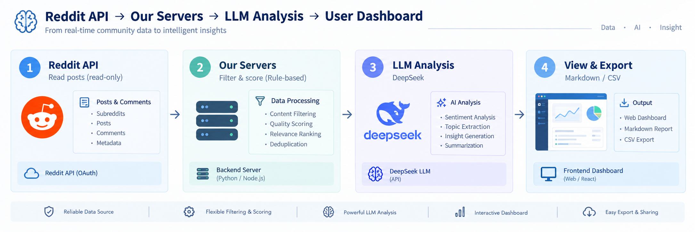

# Scoutly

Read-only Reddit discovery for SaaS teams.

Scoutly helps teams find public Reddit discussions where people ask for product recommendations, alternatives, comparisons, or workflow help. It scores each post for relevance and gives the user context for a human reply.

Scoutly does not post, comment, vote, send private messages, create Reddit accounts, or automate Reddit activity.

## What It Does

- **Finds relevant public discussions**: Users configure a product description, keywords, competitors, and subreddits.
- **Scores intent and fit**: Posts are scored on buying intent, product fit, search visibility, timing, and reply feasibility.
- **Supports human review**: Scoutly shows why a post may matter, what reply angle may help, and what to avoid.
- **Exports reports**: Users can export opportunity reports as Markdown or CSV for review.

## How It Works



1. **Configure**: The user adds a product, keywords, competitors, and optional subreddit filters.
2. **Discover**: Scoutly searches approved Reddit API data for matching public posts.
3. **Filter**: Rules remove low-quality, duplicate, or excluded posts.
4. **Score**: An LLM classifies and summarizes each candidate post.
5. **Review**: The user opens Reddit and decides whether to reply.

## Reddit API And Data Policy

Scoutly is designed for approved Reddit API access. Production use should run through OAuth or another access method approved by Reddit.

The current anonymous `.json` client exists for local development and early testing only. It should not be treated as the production data path for a commercial product.

Scoutly does not:

- Automate posts, comments, votes, messages, or account creation
- Train or fine-tune AI models on Reddit data
- Sell, license, or redistribute raw Reddit datasets
- Infer sensitive traits about Reddit users
- Match Reddit users to identities outside Reddit
- Store full comment histories

Scoutly stores the minimum data needed for reports and de-duplication, such as post title, permalink, subreddit, timestamp, score metadata, and analysis output. The current retention target is up to 30 days unless a shorter period is required.

## Tech Stack

- **Backend**: FastAPI, Celery, PostgreSQL, Redis
- **Frontend**: React, TypeScript, Vite, Tailwind CSS, shadcn/ui
- **AI**: DeepSeek-compatible OpenAI API client for classification and summaries
- **Deployment**: Docker Compose

## Project Structure

```text
├── scoutly-api/     # Backend API
│   ├── app/
│   │   ├── api/          # REST API endpoints
│   │   ├── services/     # Business logic
│   │   ├── integrations/ # Reddit API and LLM clients
│   │   ├── workers/      # Celery scan tasks
│   │   └── prompts/      # LLM prompt templates
│   └── alembic/          # Database migrations
│
└── scoutly-app/     # Frontend app
    └── src/
        ├── api/          # API client
        ├── components/   # UI components
        └── App.tsx       # Main app
```

## Local Development

Backend:

```bash
cd scoutly-api
cp .env.example .env
pip install -r requirements.txt
alembic upgrade head
uvicorn app.main:app --reload --host 0.0.0.0 --port 8000
```

Worker:

```bash
cd scoutly-api
celery -A app.workers.celery_app.celery worker --loglevel=info --concurrency=2
```

Frontend:

```bash
cd scoutly-app
npm install
npm run dev
```

## License

This project is in early development.
